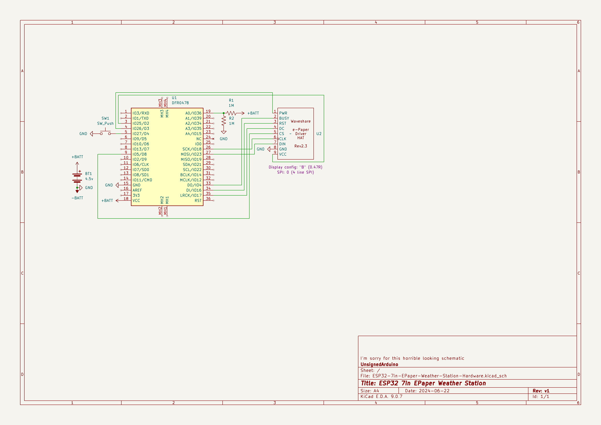

# ESP32-7in-EPaper-Weather-Station-Hardware

[Software](https://github.com/UnsignedArduino/ESP32-7in-EPaper-Weather-Station) |
Hardware | 
[Design](https://github.com/UnsignedArduino/ESP32-7in-EPaper-Weather-Station-Design)

A weather station based on a Firebeetle ESP32 and a 7.5in Waveshare E-paper 
display. The data is fetched from [Open-Meteo](https://open-meteo.com/).

## Build

This repo is a KiCad project - clone it to view the schematic. (there is no
custom PCB so far) 

